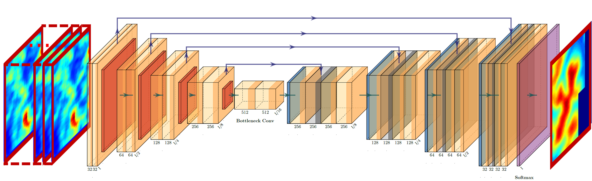
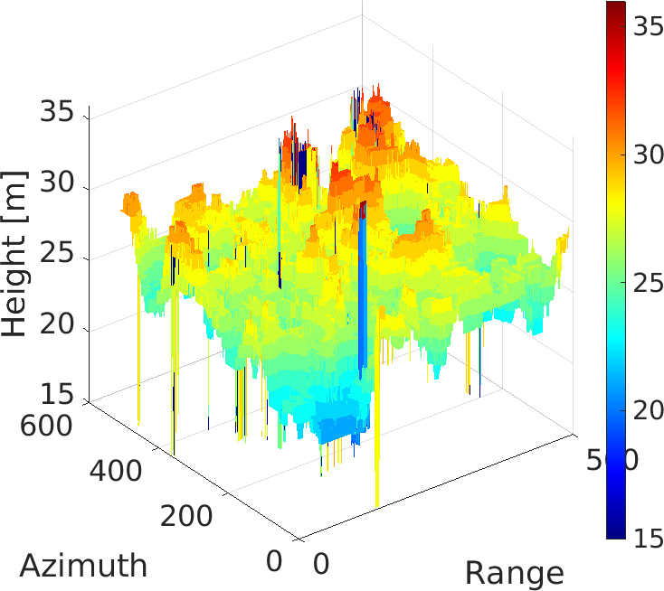
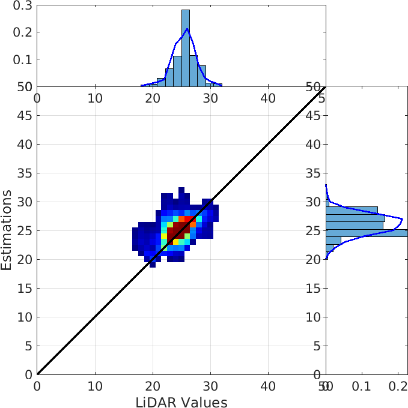
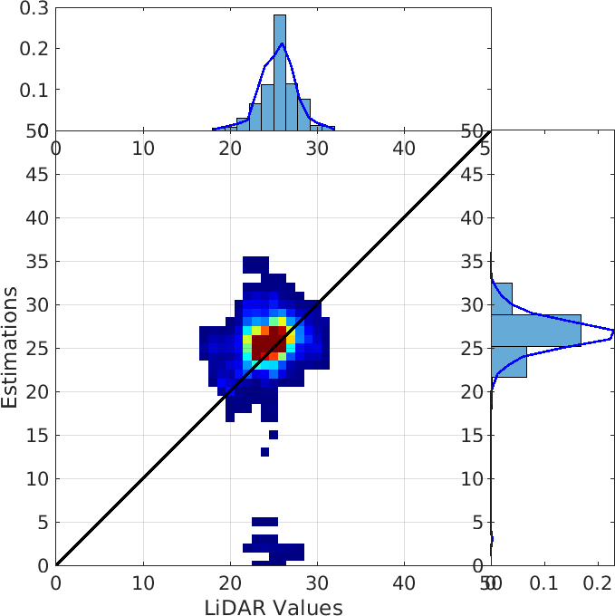
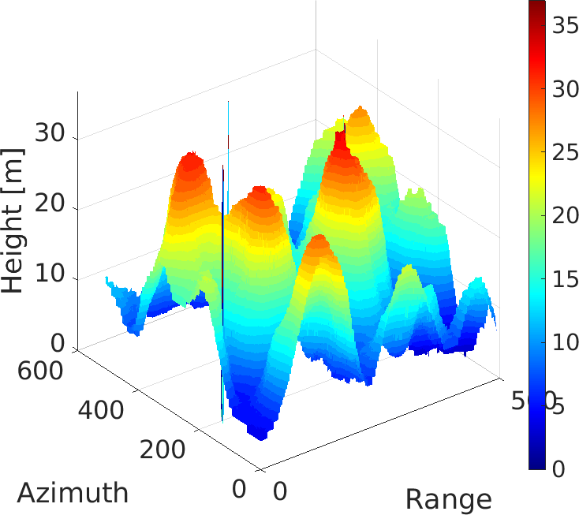
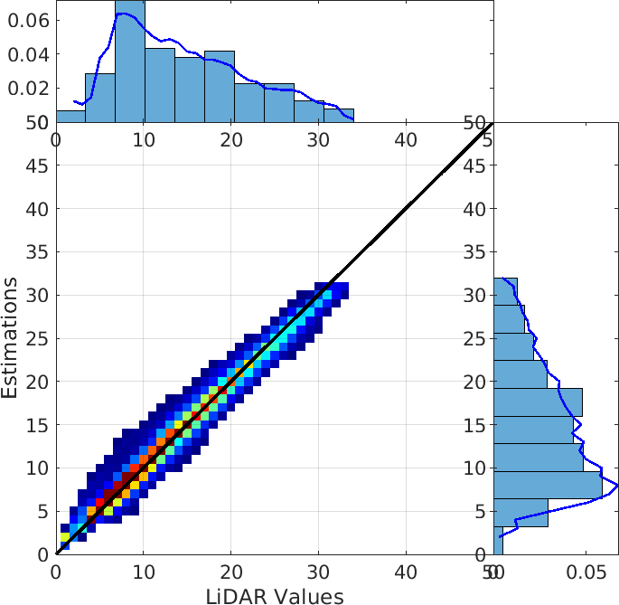
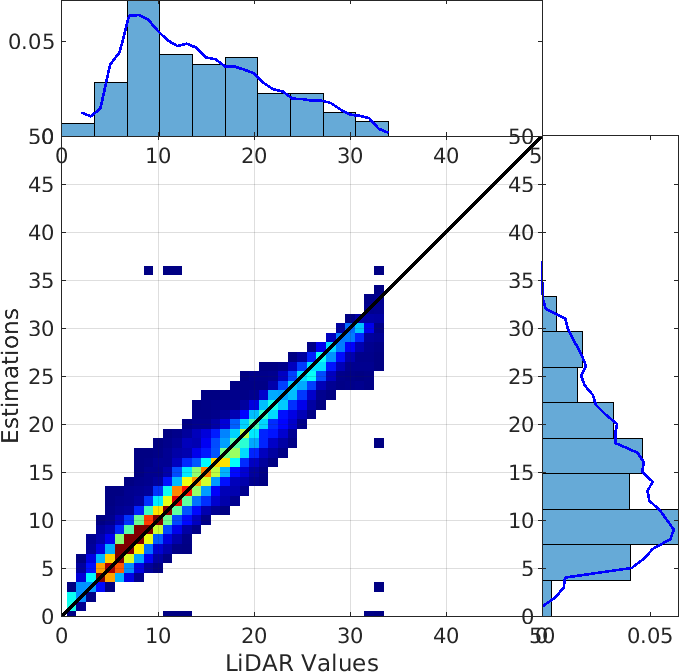

# CATSNET (multiChannel SAR foresT height reconStruction Neural nETwork)
This repository contains the testing code of [CATSNet: a context-aware network for Height Estimation in a Forested Area based on Pol-TomoSAR data](https://arxiv.org/abs/2403.20273)., an Unet-based solution for height estimation of forested areas.

If you find this information helpful and choose to incorporate it into your research, please include the following citation:
> W. Yang, S. Vitale, H. Aghababaei, G. Ferraioli, V. Pascazio, and G. Schirinzi, "CATSNet: a context-aware network for Height Estimation in a Forested Area based on Pol-TomoSAR data".

CATSNET is based on the U-Net structure proposed in [U-Net: Convolutional Networks for Biomedical Image Segmentation](https://arxiv.org/abs/1505.04597). 

  <figure>
    
  </figure>

It consists of a contracting encoder path (left side) and an expansive decoder path (right side). The number of the input image tile channels is $M$. 
The contracting part is composed of five downsampling levels: each level is composed of two $3 \times 3$ convolutional layers, followed by a [Rectified Linear Unit (ReLU)](https://proceedings.neurips.cc/paper/2012/hash/c399862d3b9d6b76c8436e924a68c45b-Abstract.html) and a $2 \times 2$ max pooling operation with stride 2 for downsampling (except for the last level). After each downsampling step, the number of feature channels is doubled. On the contrary, the expansive part is composed of five upsampling levels. As for the encoder part, each level consists of two $3 \times 3$ convolutional layers followed by ReLU and a $2 \times 2$ upsampling operation. On the contrary, in the encoder part, at each level, the number of feature maps is halved and concatenated with the corresponding feature map from the contracting path.
At the final layer, a $1\times1$ convolution is used to map each 32-component feature vector to the desired number of classes, which is the number of the forest height or ground height classes. As we can see from Fig. \ref{Unetarchi}, there are $23$ convolutional layers.

The cost function is the multiclass cross-entropy function (CE).

  <figure>
    
  </figure>

The test results are shown below:

**Forest**:

  <figure style="margin: 0; text-align: center;">
    
    <figcaption style="margin-top: 10px; display: block;">(a)</figcaption>
  </figure>
  <figure style="margin: 0; text-align: center;">
    
    <figcaption style="margin-top: 10px; display: block;">(b)</figcaption>
  </figure>
  <figure style="margin: 0; text-align: center;">
    
    <figcaption style="margin-top: 10px; display: block;">(c)</figcaption>
  </figure>

  <figure style="margin: 0; text-align: center;">
    
    <figcaption style="margin-top: 10px; display: block;">(a)</figcaption>
  </figure>
  <figure style="margin: 0; text-align: center;">
    
    <figcaption style="margin-top: 10px; display: block;">(b)</figcaption>
  </figure>

**Ground**:

  <figure style="margin: 0; text-align: center;">
    
    <figcaption style="margin-top: 10px; display: block;">(a)</figcaption>
  </figure>
  <figure style="margin: 0; text-align: center;">
    
    <figcaption style="margin-top: 10px; display: block;">(b)</figcaption>
  </figure>
  <figure style="margin: 0; text-align: center;">
    
    <figcaption style="margin-top: 10px; display: block;">(c)</figcaption>
  </figure>

  <figure style="margin: 0; text-align: center;">
    
    <figcaption style="margin-top: 10px; display: block;">(a)</figcaption>
  </figure>
  <figure style="margin: 0; text-align: center;">
    
    <figcaption style="margin-top: 10px; display: block;">(b)</figcaption>
  </figure>

# Team members
 Wenyu Yang (wenyu.yang001@studenti.uniparthenope.it); \
 Sergio Vitale (sergio.vitale@uniparthenope.it);\
 Hossein Aghababaei (h.aghababaei@utwente.nl);\
 Giampaolo Ferraioli (giampaolo.ferraioli@uniparthenope.it);\
 Vito Pascazio (vito.pascazio@uniparthenope.it);\
 Gilda  Schirinzi (gilda.schirinzi@uniparthenope.it)

 
# License
Copyright (c) 2024 Dipartimento di Ingegneria and Dipartimento di Scienze e Tecnologie of Università degli Studi di Napoli "Parthenope".

All rights reserved. This work should only be used for nonprofit purposes.

By downloading and/or using any of these files, you implicitly agree to all the
terms of the license, as specified in the document LICENSE.txt
(included in this directory)

# Usage 
* **data** folder contains calibrated SAR testing patch and uncalibrated SAR testing patch (same testing area);
  Input data:
     * *radar_nc.npy* : the input samples without phase calibration
     * *test_CHM_1.npy*: the forest height reference with quantized step, 1m
  patch2:
     * *radar_c.npy* : the input samples without phase calibration
     * *test_DTM_1.npy*: the ground height reference with quantized step, 1m

* *CHM_Weights.pth* contains trained weights of the forest height prediction
* *DTM_Weights.pth* contains trained weights of the ground height prediction
* *main.py* contains the model implementation of the forest and/or ground height prediction
* *Evaluation.py* is the main script for testing to predict the forest and/or ground heights
* *unet.py* is the U-Net network structure construction

# Prerequisites
This code is written on the Ubuntu system for Python 3.7 and uses the Pytorch library.

For correct usage of the code, please install the Python environment with the following steps:

**Installing Anaconda** (if not already installed)

1. download anaconda3 from https://www.anaconda.com/products/individual#linux
2. from the command line, move to the download directory and install the package by:
> sh <Anaconda_downloaded_version>.sh 
and follow the instructions for installation
3. add conda to path
> PATH=~/anaconda3/bin:$PATH

**Installing the conda environment**

The file ./CATSNETenv.yml contains the environment for testing the code. You can easily install it by command line:

1. move to the folder containing the GitHub repository and open the terminal
2. run the following command
 > conda env create -f CATSNETenv.yml

Once the environment has been set up, activate it by command line as well:

1. activate the environment from the command line

> conda activate CATSNETenv

2. Launch Spyder

> spyder

3. goes to the folder containing **Evaluation.py** edit, and run

**Showing results**

1. The test results in **results** folder are obtained in Matlab R2023a

**TropiSAR Data**

The data for training and testing is gotten by TropiSAR 2009, more details please refer to [TropiSAR](https://earth.esa.int/eogateway/campaigns/tropisar).
